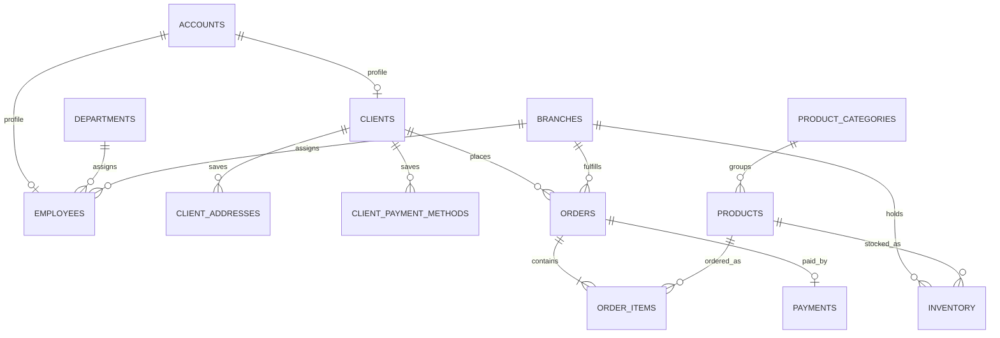

# Infinity Company API

Infinity Company API is a backend portfolio project for a hardware and software company. It manages client and staff accounts, company departments, branches, products, branch inventory, customer orders, and payment records.

The project uses FastAPI, Python, PostgreSQL, SQLAlchemy 2, Alembic, Pydantic, Docker Compose, pytest, and Ruff. The API is asynchronous from the HTTP layer through database access.

## Features

- Client registration, password hashing, JWT login, and client-only order access.
- Separate employee accounts and administrator-only company management.
- CRUD endpoints for departments, branches, employees, clients, categories, and products. Records with business history are deactivated instead of being erased.
- Hardware and software products, EGP pricing, stock per branch, low-stock levels, and safe stock transfers between branches.
- Client addresses, home delivery, and in-store pickup.
- Orders with server-calculated prices, immutable product snapshots, cash on delivery or card, and no installment field or installment plan.
- Atomic stock reservation and request-checked idempotency keys to prevent duplicate checkouts and overselling during concurrent requests.
- A local mock payment mode for laptop development and a Paymob hosted-checkout integration for card payments.
- Saved payment methods linked to clients. The application stores a provider token encrypted at rest plus limited display data (brand and last four digits). It never accepts or stores a card number or security code.
- Paymob callback HMAC verification, payment amount checks, and duplicate-callback handling.
- Alembic migrations, health endpoints, Docker Compose, automated tests, and CI checks.

## Architecture

```text
Client / Employee
       |
       v
 FastAPI routes -> Pydantic validation -> SQLAlchemy services
                                             |
                                             v
                                         PostgreSQL
                                             |
                                             v
                                Paymob hosted card checkout
```

## Data model



`ACCOUNTS` stores login credentials and roles. Client and employee business details live in linked profile tables. Orders keep item and delivery-address snapshots, so later product or address edits do not rewrite purchase history.

Card details are entered on the payment provider's hosted checkout. Infinity receives a payment result and, only when the provider reports that a card was saved, a reusable provider reference. The provider owns card processing; the API stores no PAN or CVV. Use test credentials while developing.

## Run locally with Docker

For the container setup, you need Docker and Docker Compose. For local development and checks, you also need Python 3.14 and `uv`.

1. Copy the sample settings and set a local administrator password:

   ```bash
   cp .env.example .env
   ```

   Edit `.env` and set `BOOTSTRAP_ADMIN_PASSWORD` to a private password of at least 12 characters. Do not commit `.env`.

   To save provider-issued payment tokens locally, also set `PAYMENT_TOKEN_ENCRYPTION_KEY`. Generate one with:

   ```bash
   docker compose run --rm --entrypoint python api -c 'from cryptography.fernet import Fernet; print(Fernet.generate_key().decode())'
   ```

2. Start PostgreSQL and the API:

   ```bash
   docker compose up --build
   ```

   Compose waits for PostgreSQL, applies Alembic migrations, and starts the API at <http://localhost:8000>.

3. Create the first administrator in a second terminal:

   ```bash
   docker compose exec api python -m app.bootstrap_admin
   ```

4. Open Swagger at <http://localhost:8000/docs>. Health checks are available at `/health/live` and `/health/ready`.

The default provider is `mock`. It never accepts card numbers. To demonstrate a saved card locally, sign in as a client and call `POST /api/v1/clients/me/payment-methods/demo` with fake display details, then use that payment method for a card order and complete it through the mock payment endpoint. This only simulates a payment; it cannot charge a card.

## Run without Docker

PostgreSQL must be available at the URL in `.env`.

```bash
uv sync --all-groups
uv run alembic upgrade head
uv run python -m app.bootstrap_admin
uv run uvicorn app.main:app --reload
```

Or use the `make` shortcuts: `make install`, `make up`, `make test`, `make lint`, and `make down`.

## Optional Paymob test checkout

The Paymob adapter uses the hosted Unified Checkout, so card entry stays with Paymob. It supports new cards and saved-card checkout through provider tokens. A Paymob test account is required; credentials are never included in the repository.

1. In Paymob, create a test card integration and obtain its secret key, public key, integration ID, and HMAC secret.
2. Generate a local encryption key for saved provider tokens (or use the Docker command above):

   ```bash
   uv run python -c 'from cryptography.fernet import Fernet; print(Fernet.generate_key().decode())'
   ```

3. Set `PAYMENT_PROVIDER=paymob`, the Paymob values in `.env`, and a publicly reachable HTTPS `PAYMOB_NOTIFICATION_URL` for transaction callbacks. Configure Paymob's card-token callback to the same `/api/v1/webhooks/paymob` endpoint. A local callback needs a secure tunnel. Keep all credentials out of Git.
4. Use Paymob test credentials only. Configure the provider integration for normal card payments and disable installment or buy-now-pay-later options.

The API returns a `checkout_url` for the client to open. The Paymob webhook at `/api/v1/webhooks/paymob` verifies the HMAC before changing an order or saving a provider token. The browser redirect is not used as proof that a payment succeeded.

## API outline

| Area | Main endpoints |
| --- | --- |
| Authentication | `POST /api/v1/auth/register`, `POST /api/v1/auth/token`, `GET /api/v1/auth/me` |
| Clients | `GET/PATCH /api/v1/clients/me`, `/api/v1/clients/me/addresses`, `/api/v1/clients/me/payment-methods` |
| Company | `GET /api/v1/branches`, administrator routes under `/api/v1/admin` |
| Catalog | `GET /api/v1/products`, `GET /api/v1/categories`, administrator create/update/archive routes |
| Inventory | Administrator stock list/set and `/api/v1/admin/inventory/transfers` |
| Orders | `POST/GET /api/v1/orders`, staff order list and status changes under `/api/v1/admin/orders` |
| Payments | Paymob webhook, client saved-card list/remove/default, development-only mock completion |

Protected endpoints use a bearer token from `/api/v1/auth/token`. Clients can access only their own profile, addresses, payment methods, and orders. Employees can read operational company data and orders. Administrators manage company records and stock.

## Tests and style

```bash
uv run pytest
uv run ruff check .
uv run ruff format --check .
```

Tests use a temporary SQLite database. Local and container runs use PostgreSQL. GitHub Actions runs the tests and style checks on pushes and pull requests.

## Scope

This is a learning and portfolio project, not a production payment system. Before a real launch, review the provider setup, secrets management, webhook exposure, privacy and retention needs, authorization policy, backups, monitoring, and the payment provider's current security requirements with qualified reviewers.
